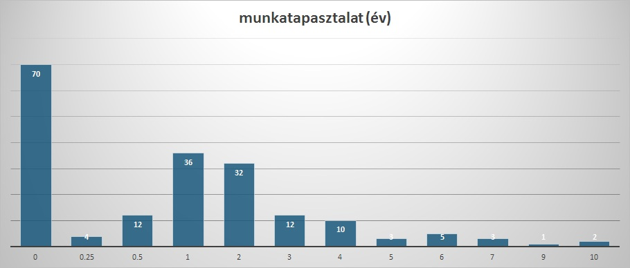

## Üdv a Műegyetem OpenSource közösségének az oldalán

2017 augusztusa végén készítettünk egy rövid felmérést az ismert nyelvekről és az OpenSource-hoz való viszonyról, a '12, '13, '14, '15-ben kezdett Villanykarosok körében.

Alapvetően azért készült a kérdőív, mert ki szeretnénk építeni egy OpenSource comunity-t a bme-n (vik-en), hogy ezzel is segítsük a gyakorlati tapasztalat szerzést. 

A kérdőívet összesen 191-en töltötték ki.

Itt találtok pár nyelvekhez kapcsolódó kérdőívet

Mikor iratkoztál be egyetemre?
--------

Itt érdemes megjegyezni, hogy kérdőív csak a VIK HK facebook oldalán és a BME-VIK 2012-2015-ös csoportokban került megosztásra.

(191 válasz)

Hány éves munka tapasztalatod van?
--------

Itt történt egy kis módosítás a válaszokban, mert a 0.2-es, 0.25-ös és 0.3-as válaszok 0.25-re, az 1.5-ös 1-re, a 2.5-ös 2-re, a 3.5-ös 3ra lettek össze vonva. Ezen válaszok és darabszámuk: 0.2 - 1; 0.3 - 1; 1.5 - 4; 2.5 -  2; 3.5 - 1 . 
A fentiek alapján (illetve, ha feltételezzük, hogy a 0.2 évet dolgozó hallgató a kitöltése óta még mindig dolgozik), a diagrammról az olvasható le, hogy legalább hány éves munka tapasztalattal rendelkeznek a kitöltők.

(190 válasz)

Nyelvtudás
========
Jelöld meg, hogy az alábbi nyelvek közül melyikből milyen szinten vagy.
--------
A megadott nyelvek eredményei:

Az “egyéb”-et jelölők válaszai:

Melyik nyelvet tanulnád meg szívesen?
--------

(178 válasz)

Git tapasztalat
--------

(191 válasz)

Látható, hogy a kitöltők nagy részének van már gittel tapasztalata és a majdnem fele nem riad vissza a bonyolultabb dolgoktól sem.

OpenSource projektek
--------

(190 válasz)

Látható, hogy van érdeklődés egy OpenSource projekt iránt, de a kitöltők többsége, még nem vett részt hasonlóban.

Milyen szinten vennél részt egy most induló OpenSource projektben?
--------

(169 válasz)

Mint minden statisztikát, ezt is érdemes fenntartásokkal kezelni. Nem érdemes ebből egy általános képet levonni, hiszen a hallgatók csekély része töltötte csak ki. 
A kérdőív elsődleges célja egy OpenSource projekt iránti érdeklődés felmérése. A fentiekből levonható, hogy van érdeklődés.
A másodlagos cél egy ilyen induló projekt nyelvének a kiválasztása. A válaszok alapján a JavaScript, Python, Java, PHP és C# lehettek versenyben. A PHP-t azért zárható ki, mert sokan nem ismerik (3.kép) és affinitás sem nagyon van rá, hogy megismerjék (6.kép), így viszont nehéz bevonni a közösséget a fejlesztésbe. 
A Java-t és a C#-ot azért, mert szerver oldalon kicsit talán nehézkesebb ezeket üzemelni, Illetve ezek forduló nyelvek ami (bár keveset, de) szintén okozhat némi problémát. 
Marad a Python és a JavaScript. A JavaScript ismerői közül több a junior és tapasztalt szintű mint a Pythonnál, talán érdemesebb ezt választani.

A kiértékeléshez használt doksit, benne az válaszokkal(email címek nélkül), [itt találjátok](surveys/17/language-stats.xlsx)
----------
